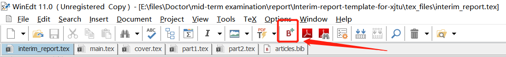

# 西安交通大学博士中期报告模板
瞅瞅你们的deadline，还在用word敲公式、插表格、加参考文献、排版改格式吗？
快让LaTex来拯救各位！（虽然用LaTex开始麻烦点，但是比起后期word浪费的大量时间，这一个小时还是超值的！）

## 1. 环境准备
模板中因为某些特殊字体，导致大家常用的overleaf和texlive无法正常编译，需要安装MikTex。（MikTex是一款适用于Windows、Linux和macOS的TeX发行版。它可以从互联网安装缺少的组件和字体包。这可以让你的TeX安装尽可能的轻量化。）

### 1.1 安装MikTex
官网链接：https://miktex.org/ 点击上方的Download并选择适合自己计算机系统的版本进行下载。以下所有流程以windows系统为例。

安装过程中需要注意勾选“自动下载缺失包”中的Yes，如下图：

    

#### 注意！
如果之前安装过texlive，安装好MikTex后系统默认的Tex就会被覆盖，变成MikTex。后期要继续用texlive的话，卸载MikTex就好。

### 1.2 安装WinEdt编辑器
去官网https://www.winedt.com/download.html 下载并安装。

### 1.3 最后的配置
1. 打开WinEdt后点击Options/Execution Modes...，在打开的窗口点击TeX System，在TeX Root栏下输入刚才MikTex的安装路径（如果按照上述安装流程走到这一步，这一栏应该已经自动填上）
2. 最后去掉TeX Root中的Auto-detect勾选，后面紧跟的还是MikTex的安装路径。（防止切换到别的tex）

## 2. 开冲！！！

### 2.1 首次编译
模板的所有文件在tex_files中。建议首先用模板编译一次，进入主文件interim_report.tex，先点击按钮：

    

（或快捷键ctrl+shift+b）用bibtex编译参考文献。这时候可能会弹出如下提醒，关闭即可。

    

再点击按钮：

    

（或快捷键ctrl+shift+p）用PDFTeXify编译文件。

#### 注意！
首次编译花费时间可能较长，因为MikTex初次安装字体较少，需要在线下载安装很多所需的字体包（1.1中已经选择了自动安装），所以需要确保有良好的网络质量。安装好字体以后，后期编译会比较快。

不出意外的话，编译生成的pdf会自动弹出。接着就可以愉快地:dog:写报告啦！

### 2.2 封面
用WinEdt打开interim_report.tex编辑封面内容，封面格式在content/cover.tex中设置。

### 2.3 正文
正文部分分别在content/main.tex、part1~4.tex中添加。
参考文献的bib文件在articles.bib中添加。

#### 注意！
以后bib中添加了参考文献首先用bibtex编译后再用PDFTeXify编译，而且每次需要在主文件interim_report.tex下进行。双击clear.bat可以删除编译产生的过程文件。一句话，习惯用ctrl+shift+b、ctrl+shift+p快捷键编译就万事大吉！

# 3. 最后
预祝各位中期考核顺利！博士毕业顺利！